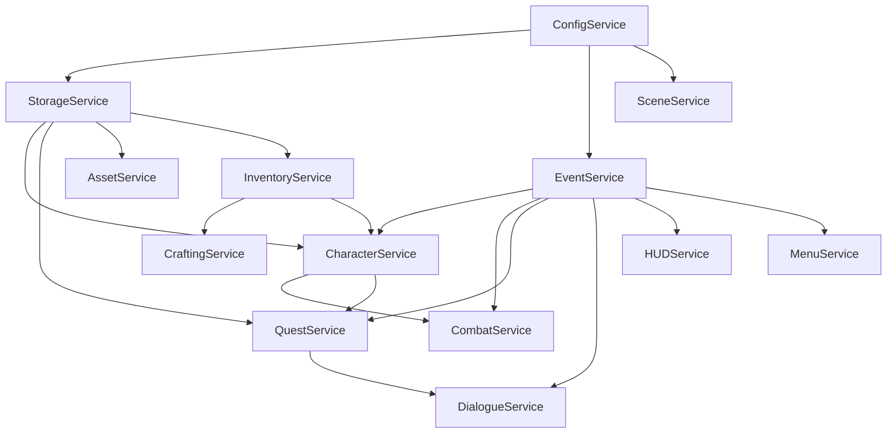
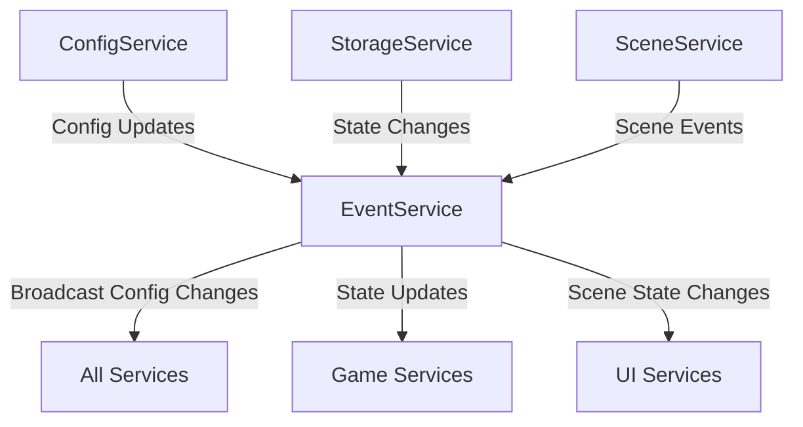
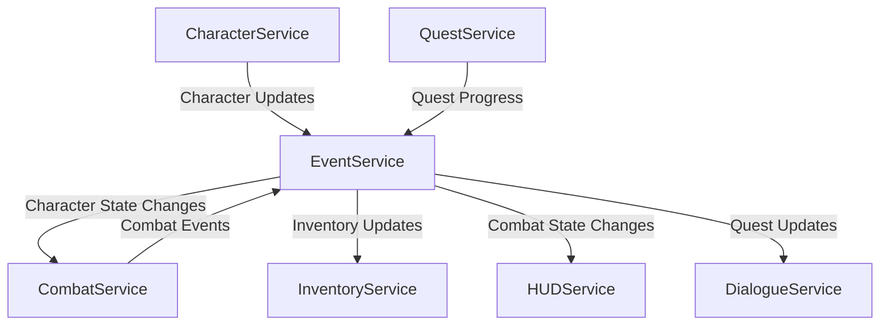
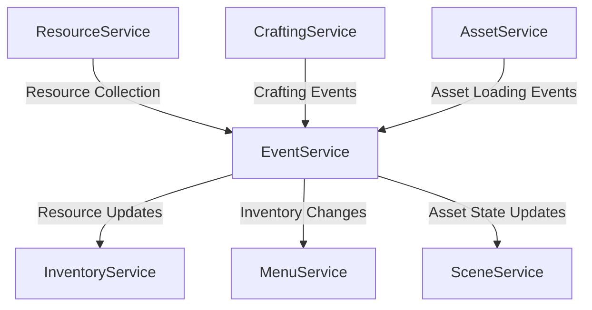
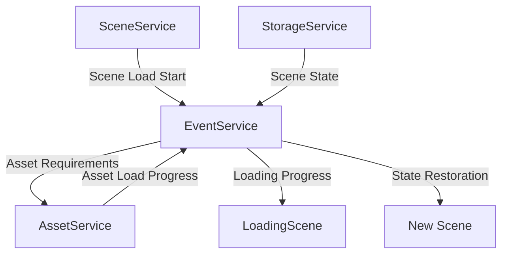
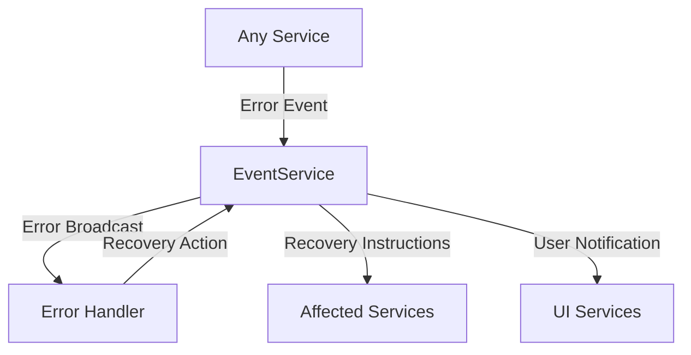
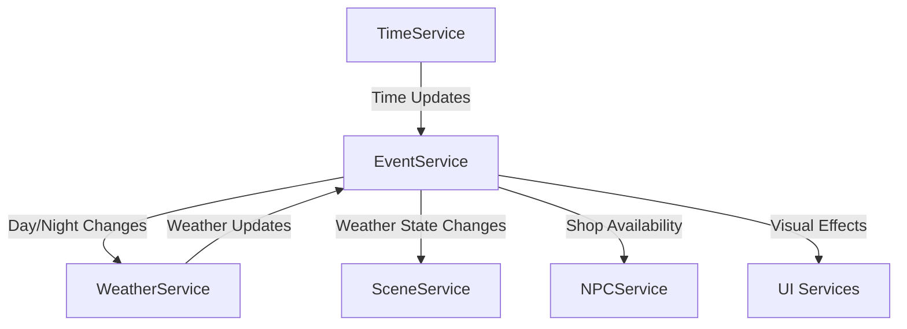
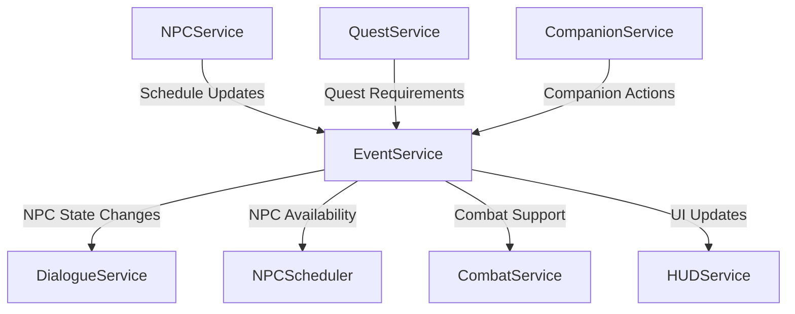
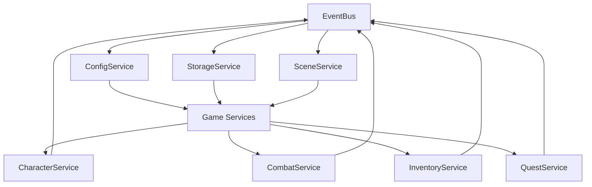

# Service Integration Architecture

## Overview
- High-level service architecture
- Integration with MVP goals from MVPDesign.md
- Alignment with Sprint 1 implementation priorities

## Core Integration Patterns
For implementation details, see [Sprint 1 Implementation Plan](mdc:docs/architecture/decisions/sprint1-implementation-plan.md#core-architecture-setup)
- Service Registry Pattern
- Event Bus Communication
- State Management
- Resource Management
- Error Handling

## Service Categories (from MVP Design)
Aligned with [Core MVP Features](mdc:docs/design/mvp-design.md#core-mvp-features):

1. Core Services
   - ConfigService: Game configuration management
   - StorageService: Data persistence (supports save system)
   - SceneService: Scene management and transitions
   - EventService: Game-wide event communication

2. Game Services (Character System)
   - CharacterService: Character creation, progression (levels 1-10)
   - CombatService: Basic melee, ranged, and class abilities
   - InventoryService: Basic equipment and resource management
   - QuestService: Main story and side quest tracking

3. Resource Services
   - ResourceService: Gathering system (mining, herbs, scavenging)
   - CraftingService: Basic weapon, potion, and repair systems
   - AssetService: Resource loading and management

4. UI Services
   - DialogueService: NPC interactions and choices
   - HUDService: Combat and status information
   - MenuService: Inventory and character screens

## Service Dependencies and Hierarchy

### Core Service Layer
1. **ConfigService** (Base Layer)
   - Dependencies: None
   - Required by: All other services
   - Purpose: Provides configuration management
   - Initialization Priority: Highest (First to initialize)

2. **StorageService** (Foundation Layer)
   - Dependencies: ConfigService
   - Required by: CharacterService, QuestService, AssetService
   - Purpose: Handles data persistence and state management
   - Initialization Priority: High (Second phase)

3. **EventService** (Communication Layer)
   - Dependencies: ConfigService
   - Required by: All game services
   - Purpose: Manages inter-service communication
   - Initialization Priority: High (Second phase)

4. **SceneService** (Management Layer)
   - Dependencies: ConfigService, EventService
   - Required by: Game scene management systems
   - Purpose: Handles scene transitions and state preservation
   - Initialization Priority: High (Second phase)

### Game Service Layer
1. **CharacterService** (Core Game Layer)
   - Dependencies: ConfigService, StorageService, EventService
   - Required by: CombatService, QuestService
   - Purpose: Manages character state and progression
   - Initialization Priority: Medium (Third phase)

2. **CombatService** (Game Mechanics Layer)
   - Dependencies: CharacterService, EventService
   - Required by: Scene combat systems
   - Purpose: Handles combat mechanics and resolution
   - Initialization Priority: Medium (Third phase)

3. **InventoryService** (Game State Layer)
   - Dependencies: StorageService, EventService
   - Required by: CraftingService, CharacterService
   - Purpose: Manages item and equipment state
   - Initialization Priority: Medium (Third phase)

4. **QuestService** (Game Logic Layer)
   - Dependencies: CharacterService, EventService, StorageService
   - Required by: DialogueService
   - Purpose: Tracks quest progress and objectives
   - Initialization Priority: Medium (Third phase)

### Resource Service Layer
1. **ResourceService** (Resource Management Layer)
   - Dependencies: StorageService, EventService
   - Required by: CraftingService
   - Purpose: Manages gathering and resource systems
   - Initialization Priority: Low (Fourth phase)

2. **CraftingService** (Resource Processing Layer)
   - Dependencies: ResourceService, InventoryService, EventService
   - Required by: None
   - Purpose: Handles crafting mechanics
   - Initialization Priority: Low (Fourth phase)

3. **AssetService** (Resource Loading Layer)
   - Dependencies: StorageService, EventService
   - Required by: All services requiring assets
   - Purpose: Manages game asset loading and caching
   - Initialization Priority: Low (Fourth phase)

### UI Service Layer
1. **DialogueService** (UI Interaction Layer)
   - Dependencies: QuestService, EventService
   - Required by: None
   - Purpose: Manages NPC interactions and choices
   - Initialization Priority: Lowest (Final phase)

2. **HUDService** (UI Display Layer)
   - Dependencies: CombatService, CharacterService, EventService
   - Required by: None
   - Purpose: Displays combat and status information
   - Initialization Priority: Lowest (Final phase)

3. **MenuService** (UI Management Layer)
   - Dependencies: InventoryService, CharacterService, EventService
   - Required by: None
   - Purpose: Manages game menus and UI state
   - Initialization Priority: Lowest (Final phase)

### Service Dependency Graph


### Service Initialization Phases
1. **Phase 1: Core Services** (Highest Priority)
   - ConfigService
   - StorageService
   - EventService
   - SceneService

2. **Phase 2: Game Systems** (High Priority)
   - CharacterService
   - InventoryService
   - CombatService
   - QuestService

3. **Phase 3: Resource Systems** (Medium Priority)
   - AssetService
   - ResourceService
   - CraftingService

4. **Phase 4: UI Services** (Low Priority)
   - HUDService
   - DialogueService
   - MenuService

### Service Communication Patterns
1. **Direct Dependencies**
   - Services explicitly declare dependencies through constructor injection
   - Dependencies are validated during service initialization
   - Circular dependencies are prevented through event-based communication

2. **Event-Based Communication**
   - Services communicate through EventService to maintain loose coupling
   - Events are strongly typed for type safety
   - Event handlers are registered during service initialization

3. **State Management**
   - Services maintain their own state
   - State changes are broadcast through events
   - StorageService handles persistence of critical state

4. **Error Handling**
   - Services implement consistent error handling patterns
   - Errors are propagated through the service hierarchy
   - Recovery mechanisms are implemented at each layer

## Integration Points
Aligned with [Technical Implementation Priorities](mdc:docs/design/mvp-design.md#technical-implementation-priorities):

### Scene Integration
- Main town hub scene management
- Outdoor area transitions
- Dungeon level loading
- Combat scene handling

### Asset Management Integration
See [Technical Considerations](mdc:docs/design/mvp-design.md#technical-considerations) for details
- Initial loading strategy
- Region-based asset loading
- Memory optimization
- Asset state persistence

### Save System Integration
- Character progression data
- World state persistence
- Quest progress tracking
- Resource node states

### Mobile Platform Integration
- Touch controls adaptation
- UI scaling
- Performance optimization

## Future Expansion Points
Based on [Future Development Roadmap](mdc:docs/design/mvp-design.md#future-development-roadmap):

### Release 1.1 - World Expansion
- Multi-town scene management
- Enhanced weather service integration
- Extended quest service capabilities
- Advanced crafting service features

### Release 1.2 - Character Depth
- Enhanced skill system integration
- Advanced combat service features
- Extended companion AI services
- Character customization service expansion

### Release 1.3 - Social Systems
- Faction service integration
- Reputation tracking service
- Enhanced NPC relationship system
- Housing system integration

### Release 1.4 - Environmental Enhancement
- Advanced weather system integration
- Dynamic event service
- Enhanced resource system
- World event management

### Release 2.0 - Major Expansion
- Multiplayer service integration
- Advanced faction warfare system
- Economic service integration
- Enhanced crafting system 

## Document Purpose
This document defines the service integration patterns and standards for our browser-based RPG, establishing how services interact, communicate, and manage dependencies. It provides implementation guidelines that support both immediate MVP requirements and future vision expansion.

## Related Documents
- [MVPDesign.md](mdc:docs/design/MVPDesign.md) - MVP scope and requirements
- [VisionDesign.md](mdc:docs/design/vision-design.md) - Long-term vision and expansion plans
- [MVPHighLevelArchitecture.md](mdc:docs/architecture/patterns/MVPHighLevelArchitecture.md) - Technical architecture overview
- [Service Registry API](../../api/services/sprint1/service-registry-api.md) - Service registry implementation details
  - [Core Interface](../../api/services/sprint1/service-registry-api.md#core-interface) - Service Registry class implementation
  - [Basic Usage](../../api/services/sprint1/service-registry-api.md#usage-examples) - Service registration and initialization
  - [Advanced Usage](../../api/services/sprint1/service-registry-api.md#advanced-usage-examples) - Complex service patterns
  - [Error Handling](../../api/services/sprint1/service-registry-api.md#error-handling) - Service error management
- [Service Testing Guide](../../docs/testing/unit/services.md) - Unit testing guidelines for services
- [Service Registry Pattern](mdc:docs/architecture/patterns/service-registry.md) - Service Registry pattern details
- [Sprint1ImplementationPlan.md](mdc:docs/architecture/decisions/sprint1-implementation-plan.md) - Detailed implementation tasks
- [TypeScript Standards](../../.cursor/rules/typescript.mdc) - TypeScript coding standards

## Service Integration Overview

### Key Principles
1. **Loose Coupling**: Services should minimize direct dependencies
2. **High Cohesion**: Services should have focused responsibilities
3. **Lifecycle Management**: Clear initialization and cleanup procedures
4. **State Management**: Controlled state sharing between services
5. **Error Resilience**: Graceful handling of service failures

### Implementation Tasks
For detailed implementation tasks and timeline, see [Sprint 1 Implementation Tasks](mdc:docs/architecture/decisions/sprint1-implementation-plan.md#implementation-tasks):
1. Core Architecture Setup (Days 3-6)
   - Define core interfaces and types
   - Implement ServiceRegistry pattern
   - Create EventBus system
   - Implement core game configuration
   - Establish persistence strategy
   - Set up base scene architecture

2. Game Loop Implementation (Days 6-8)
   - Create main game instance configuration
   - Implement basic game loop structure
   - Create debug utilities
   - Build minimal playable prototype

### Risk Management
For detailed risk assessment and mitigation strategies, see [Risk Assessment](mdc:docs/architecture/decisions/sprint1-implementation-plan.md#risk-assessment)

## Type Safety Boundaries

### Core Type Safety Principles
1. **Service Interface Contracts**
   - All services must implement their respective interfaces
   - Method signatures must be explicitly typed
   - Return types must be clearly defined
   - Generic types should be used for reusable service patterns

2. **Data Transfer Objects (DTOs)**
   - Strict typing for all service-to-service communication
   - Immutable interfaces for data passed between services
   - Validation at service boundaries
   - Type guards for runtime type checking

3. **Event Type Safety**
   - Typed event payloads
   - Typed event handlers
   - Event type registry for compile-time checking
   - Type-safe event subscription patterns

### Implementation Guidelines
1. **Service Method Types**
   ```typescript
   // See detailed implementation in [Service Registry API Core Interface](../../api/services/sprint1/service-registry-api.md#core-interface)
   interface IGameService<TConfig extends BaseConfig> {
     readonly config: TConfig;
     init(): Promise<void>;
     destroy(): Promise<void>;
     getState(): ServiceState;
   }
   ```

2. **Event Type Safety**
   ```typescript
   interface GameEvent<T extends EventPayload> {
     type: string;
     payload: T;
     timestamp: number;
   }

   type EventHandler<T extends EventPayload> = (event: GameEvent<T>) => void;
   ```

3. **Service State Types**
   ```typescript
   interface ServiceState<T extends BaseState> {
     readonly status: ServiceStatus;
     readonly data: T;
     readonly lastUpdated: number;
   }
   ```

### Type Boundary Enforcement
1. **Service Registration**
   For detailed implementation examples, see [Service Registry API Usage Examples](../../api/services/sprint1/service-registry-api.md#usage-examples)
   - Type checking during service registration
   - Dependency type validation
   - Configuration type validation
   - Runtime type assertions in development

2. **Inter-Service Communication**
   - Type-safe method calls
   - Typed event emission and handling
   - State update type validation
   - Error type hierarchies

3. **External Integration Points**
   - Type definitions for external APIs
   - Type-safe asset loading
   - Phaser.js type integration
   - Third-party library type definitions

### Type Safety Best Practices
1. **Avoid Type Assertions**
   - Use type guards instead of type assertions
   - Implement proper type narrowing
   - Create custom type guard functions
   - Document type assumptions

2. **Generic Constraints**
   - Use bounded generics where appropriate
   - Constrain generic types to interfaces
   - Provide default generic types
   - Document generic type requirements

3. **Error Handling Types**
   ```typescript
   interface ServiceError extends Error {
     readonly code: ErrorCode;
     readonly service: string;
     readonly context: unknown;
   }

   type ErrorHandler<T extends ServiceError> = (error: T) => void;
   ```

### Testing Type Safety
1. **Type Testing**
   - Unit tests for type guards
   - Integration tests for service boundaries
   - Type assertion tests
   - Generic type tests

2. **Mock Type Safety**
   - Type-safe mock implementations
   - Mock factory type checking
   - Test utility type definitions
   - Type-safe test fixtures

## MVP Service Dependencies
Based on [Sprint 1 Implementation Plan](mdc:docs/architecture/decisions/sprint1-implementation-plan.md#core-architecture-setup)

### Core Service Dependencies
1. **ConfigService**
   - No dependencies
   - Required by: All other services
   - Initialization: First

2. **StorageService**
   - Dependencies: ConfigService
   - Required by: CharacterService, QuestService, AssetService
   - Handles: Save data, game state persistence

3. **EventService**
   - Dependencies: ConfigService
   - Required by: All game services
   - Manages: Inter-service communication

4. **SceneService**
   - Dependencies: ConfigService, EventService
   - Required by: Game scene management
   - Handles: Scene transitions, state preservation

### Game Service Dependencies
1. **CharacterService**
   - Dependencies: ConfigService, StorageService, EventService
   - Required by: CombatService, QuestService
   - Manages: Character state and progression

2. **CombatService**
   - Dependencies: CharacterService, EventService
   - Required by: Scene combat systems
   - Handles: Combat mechanics and resolution

3. **InventoryService**
   - Dependencies: StorageService, EventService
   - Required by: CraftingService, CharacterService
   - Manages: Item and equipment state

4. **QuestService**
   - Dependencies: CharacterService, EventService, StorageService
   - Required by: DialogueService
   - Tracks: Quest progress and objectives

## Service Initialization Order
Aligned with [Technical Implementation Priorities](mdc:docs/design/mvp-design.md#technical-implementation-priorities)

### Phase 1: Core Services
1. ConfigService initialization
2. StorageService setup and data loading
3. EventService establishment
4. SceneService preparation

### Phase 2: Game Systems
1. CharacterService initialization
2. InventoryService setup
3. CombatService preparation
4. QuestService initialization

### Phase 3: Resource Systems
1. AssetService initialization
2. ResourceService setup
3. CraftingService preparation

### Phase 4: UI Services
1. HUDService initialization
2. DialogueService setup
3. MenuService preparation

## Phaser.js Game Loop Integration
Based on [Key Architectural Considerations](mdc:docs/architecture/decisions/sprint1-implementation-plan.md#key-architectural-considerations)

### Service Update Cycle
1. **Pre-Update Phase**
   - Input processing
   - Event queue processing
   - State synchronization

2. **Fixed Update Phase**
   - Physics updates
   - Combat calculations
   - AI processing
   - Collision detection

3. **Variable Update Phase**
   - Animation updates
   - Visual effects
   - UI updates
   - Camera movement

4. **Post-Update Phase**
   - State cleanup
   - Event cleanup
   - Performance monitoring

### Scene Integration Points
1. **Scene Lifecycle Hooks**
   - init: Service initialization
   - preload: Asset loading
   - create: Scene setup
   - update: Game loop integration

2. **Service State Management**
   - Scene-specific service instances
   - Global service access
   - State preservation between scenes
   - Resource cleanup on scene exit

## Asset Integration Strategy
Aligned with [Technical Considerations](mdc:docs/design/mvp-design.md#technical-considerations)

### Asset Loading Strategy
1. **Initial Load**
   - Core game assets
   - UI elements
   - Common resources
   - Base character assets

2. **Dynamic Loading**
   - Scene-specific assets
   - Area resources
   - NPC assets
   - Quest-related content

### Asset State Management
1. **Persistence Layer**
   - World object states
   - Modified environment elements
   - Resource node states
   - Player modifications

2. **Memory Management**
   - Asset pooling for common objects
   - Scene-based unloading
   - Texture atlas optimization
   - Audio resource management

### Storage Implementation
1. **LocalStorage Usage**
   - Game settings
   - Player preferences
   - Quick save data
   - UI state

2. **IndexedDB Integration**
   - Large asset caching
   - World state data
   - Character inventories
   - Quest progress

### Asset Version Control
1. **Compatibility Management**
   - Asset versioning system
   - Migration strategies
   - Fallback handling
   - Update management

2. **Reference System**
   - Static asset references
   - Dynamic content linking
   - State delta storage
   - Efficient save data structure

## Event Flow and Service Interactions

### Event Flow Diagrams

### Core Service Event Flow


### Game Service Event Flow


### Resource Management Event Flow


### Scene Transition Event Flow


### Error Handling Event Flow


### Weather System Event Flow


### NPC System Event Flow


## Event Flow and Service Interactions

### Event Flow Diagrams



### Service Interaction Examples

#### Combat System Interaction
```typescript
// Example of service interaction in combat system
class CombatService implements IGameService {
  private characterService: CharacterService;
  private inventoryService: InventoryService;
  private eventBus: IEventBus;

  constructor(
    characterService: CharacterService,
    inventoryService: InventoryService,
    eventBus: IEventBus
  ) {
    this.characterService = characterService;
    this.inventoryService = inventoryService;
    this.eventBus = eventBus;
  }

  async processCombatAction(action: CombatAction): Promise<void> {
    // 1. Validate character state
    const character = await this.characterService.getCharacter(action.characterId);
    if (!character.canPerformAction(action.type)) {
      throw new CombatError('Character cannot perform this action');
    }

    // 2. Check equipment requirements
    const equipment = await this.inventoryService.getEquippedItems(action.characterId);
    if (!this.validateEquipment(action, equipment)) {
      throw new CombatError('Required equipment not equipped');
    }

    // 3. Process action and emit events
    const result = this.calculateCombatResult(action, character, equipment);
    
    // 4. Update character state
    await this.characterService.updateCharacter(character.id, {
      health: result.newHealth,
      status: result.newStatus
    });

    // 5. Emit combat events
    await this.eventBus.emit('combat.action.completed', {
      action,
      result,
      timestamp: Date.now()
    });
  }
}
```

#### Quest System Interaction
```typescript
class QuestService implements IGameService {
  private characterService: CharacterService;
  private inventoryService: InventoryService;
  private storageService: StorageService;
  private eventBus: IEventBus;

  async updateQuestProgress(questId: string, characterId: string): Promise<void> {
    // 1. Get current quest state
    const quest = await this.storageService.getQuest(questId);
    const character = await this.characterService.getCharacter(characterId);

    // 2. Check quest requirements
    if (this.checkQuestRequirements(quest, character)) {
      // 3. Update quest progress
      const updatedQuest = await this.progressQuest(quest);
      
      // 4. If quest completed, give rewards
      if (updatedQuest.status === 'completed') {
        await this.giveQuestRewards(updatedQuest, character);
        
        // 5. Emit quest completion event
        await this.eventBus.emit('quest.completed', {
          questId,
          characterId,
          rewards: updatedQuest.rewards
        });
      }
    }
  }

  private async giveQuestRewards(quest: Quest, character: Character): Promise<void> {
    // Coordinate with other services to give rewards
    await Promise.all([
      this.inventoryService.addItems(character.id, quest.rewards.items),
      this.characterService.addExperience(character.id, quest.rewards.experience)
    ]);
  }
}
```

### Type Safety Boundaries

#### Service Interface Definitions
```typescript
// Core service interfaces with type safety
interface IGameService {
  init(): Promise<void>;
  destroy(): void;
}

interface ICharacterService extends IGameService {
  getCharacter(id: string): Promise<Character>;
  updateCharacter(id: string, updates: Partial<Character>): Promise<void>;
  addExperience(id: string, amount: number): Promise<void>;
}

interface IInventoryService extends IGameService {
  getItems(characterId: string): Promise<Item[]>;
  addItems(characterId: string, items: Item[]): Promise<void>;
  removeItems(characterId: string, itemIds: string[]): Promise<void>;
}

// Type-safe event definitions
interface GameEventMap {
  'character.updated': {
    characterId: string;
    changes: Partial<Character>;
  };
  'inventory.changed': {
    characterId: string;
    added?: Item[];
    removed?: string[];
  };
  'quest.completed': {
    questId: string;
    characterId: string;
    rewards: QuestRewards;
  };
}

// Type-safe event bus
interface IEventBus {
  emit<K extends keyof GameEventMap>(
    event: K,
    payload: GameEventMap[K]
  ): Promise<void>;
  
  on<K extends keyof GameEventMap>(
    event: K,
    handler: (payload: GameEventMap[K]) => void
  ): void;
}
```

### Service State Management

#### State Synchronization Example
```typescript
class GameStateManager implements IGameService {
  private services: Map<string, IGameService> = new Map();
  private eventBus: IEventBus;

  async saveGameState(): Promise<void> {
    const state: GameState = {
      character: await this.getServiceState('character'),
      inventory: await this.getServiceState('inventory'),
      quests: await this.getServiceState('quest'),
      world: await this.getServiceState('world')
    };

    // Validate state before saving
    this.validateGameState(state);

    // Notify services of impending save
    await this.eventBus.emit('game.saving', { timestamp: Date.now() });

    // Save state
    await this.storageService.saveGameState(state);

    // Confirm save completed
    await this.eventBus.emit('game.saved', {
      timestamp: Date.now(),
      state: state
    });
  }

  private validateGameState(state: GameState): void {
    // Type-safe validation of game state
    const validator = new GameStateValidator();
    const result = validator.validate(state);

    if (!result.isValid) {
      throw new GameStateError('Invalid game state', result.errors);
    }
  }
}
```

### Basic Service Communication
```typescript
// Example 1: Character takes damage and updates UI
class CombatService {
  private eventService: EventService;
  
  async handleDamage(characterId: string, damage: number): Promise<void> {
    // Get character data
    const character = await this.characterService.getCharacter(characterId);
    
    // Apply damage
    character.health -= damage;
    
    // Emit event for other services
    this.eventService.emit('character.damaged', {
      characterId,
      damage,
      remainingHealth: character.health
    });
    
    // Save character state
    await this.characterService.updateCharacter(character);
  }
}

// HUDService listening for damage events
class HUDService {
  constructor(eventService: EventService) {
    eventService.on('character.damaged', this.updateHealthDisplay.bind(this));
  }
  
  private updateHealthDisplay(data: CharacterDamagedEvent): void {
    // Update health bar UI
    this.healthBar.setHealth(data.remainingHealth);
  }
}
```

### Complex Service Interactions
```typescript
// Example 2: Quest completion with multiple service interactions
class QuestService {
  constructor(
    private eventService: EventService,
    private characterService: CharacterService,
    private inventoryService: InventoryService,
    private dialogueService: DialogueService
  ) {}
  
  async completeQuest(questId: string, characterId: string): Promise<void> {
    try {
      // 1. Get quest and character data
      const [quest, character] = await Promise.all([
        this.getQuest(questId),
        this.characterService.getCharacter(characterId)
      ]);
      
      // 2. Verify quest requirements
      await this.verifyQuestRequirements(quest, character);
      
      // 3. Award quest rewards
      await Promise.all([
        // Update character experience
        this.characterService.addExperience(characterId, quest.experienceReward),
        // Add items to inventory
        this.inventoryService.addItems(characterId, quest.itemRewards),
        // Mark quest as complete
        this.markQuestComplete(questId, characterId)
      ]);
      
      // 4. Trigger completion dialogue
      await this.dialogueService.showQuestCompletion(quest.completionDialogue);
      
      // 5. Emit quest completion event
      this.eventService.emit('quest.completed', {
        questId,
        characterId,
        rewards: quest.rewards
      });
      
    } catch (error) {
      // Handle errors and notify services
      this.eventService.emit('quest.error', {
        questId,
        characterId,
        error: error.message
      });
      throw error;
    }
  }
}
```

### Resource Management Example
```typescript
// Example 3: Crafting item with resource management
class CraftingService {
  constructor(
    private eventService: EventService,
    private inventoryService: InventoryService,
    private resourceService: ResourceService
  ) {}
  
  async craftItem(recipe: CraftingRecipe, characterId: string): Promise<void> {
    // 1. Check resource availability
    const hasResources = await this.resourceService.checkResources(
      characterId,
      recipe.requirements
    );
    
    if (!hasResources) {
      throw new Error('Insufficient resources for crafting');
    }
    
    // 2. Begin crafting process
    this.eventService.emit('crafting.started', {
      recipeId: recipe.id,
      characterId
    });
    
    try {
      // 3. Consume resources
      await this.resourceService.consumeResources(
        characterId,
        recipe.requirements
      );
      
      // 4. Create the item
      const craftedItem = await this.createItem(recipe);
      
      // 5. Add to inventory
      await this.inventoryService.addItem(characterId, craftedItem);
      
      // 6. Notify completion
      this.eventService.emit('crafting.completed', {
        recipeId: recipe.id,
        characterId,
        item: craftedItem
      });
      
    } catch (error) {
      // 7. Handle failures and potential resource refunds
      await this.handleCraftingFailure(recipe, characterId, error);
    }
  }
}
```

### Scene Transition Example
```typescript
// Example 4: Complex scene transition with state preservation
class SceneService {
  constructor(
    private eventService: EventService,
    private storageService: StorageService
  ) {}
  
  async transitionToScene(
    fromScene: string,
    toScene: string,
    transitionData: SceneTransitionData
  ): Promise<void> {
    try {
      // 1. Notify pre-transition
      this.eventService.emit('scene.pretransition', {
        fromScene,
        toScene,
        data: transitionData
      });
      
      // 2. Save current scene state
      await this.storageService.saveSceneState(fromScene, {
        timestamp: Date.now(),
        data: transitionData.stateToPreserve
      });
      
      // 3. Load target scene resources
      await this.loadSceneResources(toScene);
      
      // 4. Perform transition
      await this.executeSceneTransition(fromScene, toScene, transitionData);
      
      // 5. Restore relevant state in new scene
      const restoredState = await this.storageService.loadSceneState(toScene);
      if (restoredState) {
        this.eventService.emit('scene.staterestored', {
          scene: toScene,
          state: restoredState
        });
      }
      
      // 6. Notify completion
      this.eventService.emit('scene.transitioned', {
        fromScene,
        toScene,
        data: transitionData
      });
      
    } catch (error) {
      // Handle transition failures
      this.eventService.emit('scene.transitionfailed', {
        fromScene,
        toScene,
        error: error.message
      });
      throw error;
    }
  }
}
```

These examples demonstrate key service integration patterns:
- Event-driven communication
- Proper error handling
- Asynchronous operation management
- State preservation
- Resource cleanup
- Service dependency management
- Type-safe interactions

## Common Integration Pattern Examples

### 1. Service Registration and Initialization
```typescript
// Example of proper service registration and initialization
class GameService implements IGameService {
  private static instance: GameService;
  private eventBus: IEventBus;
  private configService: IConfigService;
  
  private constructor() {}
  
  public static getInstance(): GameService {
    if (!GameService.instance) {
      GameService.instance = new GameService();
    }
    return GameService.instance;
  }
  
  async init(): Promise<void> {
    // Get required services
    const registry = ServiceRegistry.getInstance();
    this.eventBus = registry.get<IEventBus>('events');
    this.configService = registry.get<IConfigService>('config');
    
    // Initialize with configuration
    const config = await this.configService.getGameConfig();
    
    // Set up event listeners
    this.eventBus.on('game.state.change', this.handleStateChange.bind(this));
    
    // Emit initialization complete
    this.eventBus.emit('game.service.ready', { timestamp: Date.now() });
  }
  
  destroy(): void {
    this.eventBus.off('game.state.change', this.handleStateChange.bind(this));
  }
  
  private handleStateChange(event: GameStateChangeEvent): void {
    // Handle state changes
  }
}
```

### 2. Event-Based Communication
```typescript
// Example of service communication through events
class CombatService implements IGameService {
  private eventBus: IEventBus;
  private playerService: IPlayerService;
  
  async handleCombatAction(action: CombatAction): Promise<void> {
    try {
      // Get current player state
      const player = await this.playerService.getPlayerState();
      
      // Process combat action
      const result = this.calculateCombatResult(action, player);
      
      // Update player state
      await this.playerService.updateHealth(result.newHealth);
      
      // Emit combat result event
      this.eventBus.emit('combat.action.completed', {
        action,
        result,
        timestamp: Date.now()
      });
      
    } catch (error) {
      // Emit error event
      this.eventBus.emit('combat.action.failed', {
        action,
        error: error.message,
        timestamp: Date.now()
      });
      throw error;
    }
  }
}
```

### 3. Resource Management
```typescript
// Example of resource management between services
class ResourceService implements IGameService {
  private storageService: IStorageService;
  private eventBus: IEventBus;
  
  async loadResources(sceneId: string): Promise<void> {
    try {
      // Check cache first
      const cached = await this.storageService.getCachedResources(sceneId);
      if (cached) {
        this.eventBus.emit('resources.loaded.fromCache', {
          sceneId,
          resources: cached
        });
        return;
      }
      
      // Load resources
      const resources = await this.loadResourcesFromServer(sceneId);
      
      // Cache for future use
      await this.storageService.cacheResources(sceneId, resources);
      
      // Notify resource loading complete
      this.eventBus.emit('resources.loaded', {
        sceneId,
        resources,
        timestamp: Date.now()
      });
      
    } catch (error) {
      this.eventBus.emit('resources.load.failed', {
        sceneId,
        error: error.message,
        timestamp: Date.now()
      });
      throw error;
    }
  }
}
```

### 4. State Management
```typescript
// Example of state management across services
class GameStateService implements IGameService {
  private eventBus: IEventBus;
  private storageService: IStorageService;
  
  async saveGameState(): Promise<void> {
    try {
      // Notify state save starting
      this.eventBus.emit('game.state.saving', {
        timestamp: Date.now()
      });
      
      // Collect state from all services
      const state = await this.collectServiceStates();
      
      // Save state
      await this.storageService.saveGameState(state);
      
      // Notify save complete
      this.eventBus.emit('game.state.saved', {
        timestamp: Date.now(),
        state
      });
      
    } catch (error) {
      this.eventBus.emit('game.state.save.failed', {
        error: error.message,
        timestamp: Date.now()
      });
      throw error;
    }
  }
  
  private async collectServiceStates(): Promise<GameState> {
    const registry = ServiceRegistry.getInstance();
    const services = registry.getAllServices();
    
    // Collect state from each service
    const states = await Promise.all(
      services.map(async service => ({
        serviceId: service.getId(),
        state: await service.getState()
      }))
    );
    
    return {
      timestamp: Date.now(),
      services: states
    };
  }
}
```

### 5. Error Handling and Recovery
```typescript
// Example of error handling and recovery pattern
class ErrorHandlingService implements IGameService {
  private eventBus: IEventBus;
  private healthyServices: Set<string> = new Set();
  
  async handleServiceError(error: ServiceError): Promise<void> {
    try {
      // Log error
      console.error(`Service error: ${error.message}`, error);
      
      // Remove from healthy services
      this.healthyServices.delete(error.serviceId);
      
      // Notify system of service failure
      this.eventBus.emit('service.failed', {
        serviceId: error.serviceId,
        error: error.message,
        timestamp: Date.now()
      });
      
      // Attempt recovery
      await this.recoverService(error.serviceId);
      
    } catch (recoveryError) {
      // If recovery fails, emit critical error
      this.eventBus.emit('service.recovery.failed', {
        serviceId: error.serviceId,
        error: recoveryError.message,
        timestamp: Date.now()
      });
    }
  }
  
  private async recoverService(serviceId: string): Promise<void> {
    const registry = ServiceRegistry.getInstance();
    const service = registry.get(serviceId);
    
    // Attempt service reinitialization
    await service.destroy();
    await service.init();
    
    // Mark as healthy if recovery successful
    this.healthyServices.add(serviceId);
    
    // Notify system of recovery
    this.eventBus.emit('service.recovered', {
      serviceId,
      timestamp: Date.now()
    });
  }
}
```