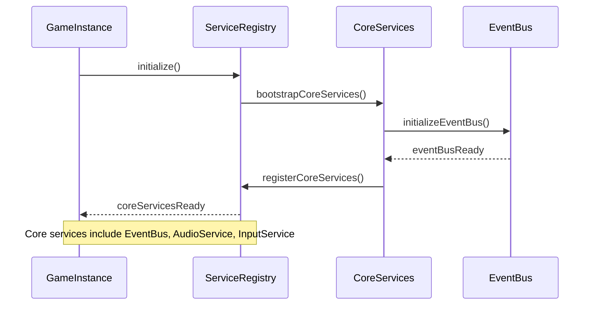
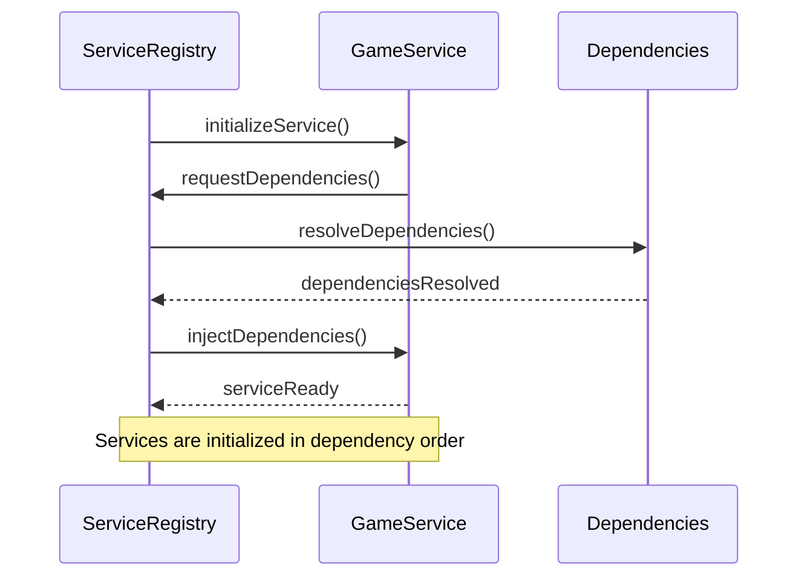
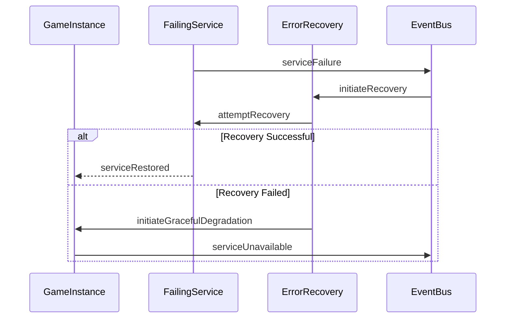
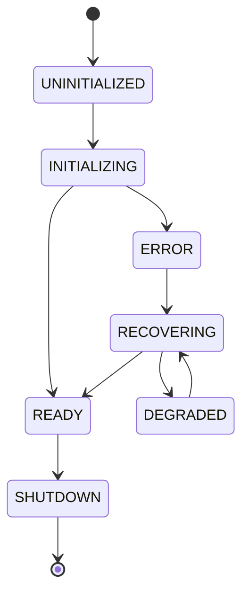

# Service Initialization Sequence Documentation

## Overview
This document details the service initialization sequence, dependency resolution order, and error recovery paths in our game architecture. The sequence diagrams and documentation provided here serve as the definitive reference for understanding how services are initialized and managed throughout the application lifecycle.

## Service Initialization Sequence

### Core Service Bootstrap Sequence

### Dependency Resolution Order

### Error Recovery Flow

## Initialization Process Details

### 1. Core Service Bootstrap
1. Game instance triggers ServiceRegistry initialization
2. ServiceRegistry bootstraps core services in the following order:
   - EventBus
   - ConfigurationService
   - LoggingService
   - AudioService
   - InputService
3. Each core service registers with the ServiceRegistry
4. ServiceRegistry validates core service initialization

### 2. Dependency Resolution
1. ServiceRegistry maintains a dependency graph
2. Services declare their dependencies through metadata
3. Resolution occurs in topological order
4. Circular dependencies are detected and prevented
5. Optional dependencies are handled gracefully

### 3. Error Recovery Strategies
1. Immediate retry for transient failures
2. Graceful degradation for persistent failures
3. Service replacement for critical failures
4. State preservation during recovery
5. Event notification for service status changes

## Service State Management

### Service Lifecycle States
- UNINITIALIZED
- INITIALIZING
- READY
- ERROR
- RECOVERING
- DEGRADED
- SHUTDOWN

### State Transitions

## Testing Considerations

### Initialization Testing
1. Verify correct initialization order
2. Test dependency resolution
3. Validate error recovery paths
4. Check state transitions
5. Test service communication post-initialization

### Integration Testing
1. Verify service interactions
2. Test cross-service dependencies
3. Validate event propagation
4. Check error handling across services
5. Test system-wide state consistency

## Best Practices

### Service Implementation
1. Declare dependencies explicitly
2. Implement proper error handling
3. Follow the initialization lifecycle
4. Use typed events for communication
5. Maintain service independence

### Error Handling
1. Implement graceful degradation
2. Preserve system stability
3. Log meaningful error messages
4. Provide recovery mechanisms
5. Maintain service boundaries

## Related Documentation
- [Service Architecture Overview](./service-architecture.md)
- [Event System Documentation](./event-system.md)
- [Error Handling Guidelines](./error-handling.md)
- [Testing Strategy](../testing/service-testing.md) 