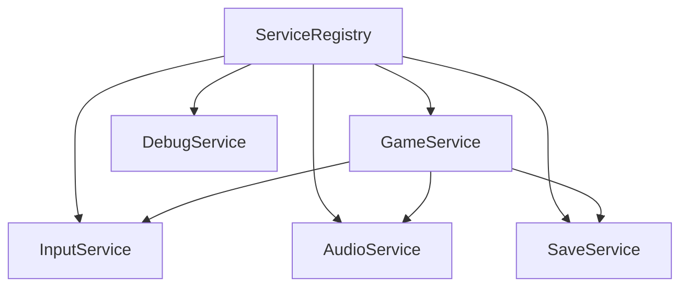
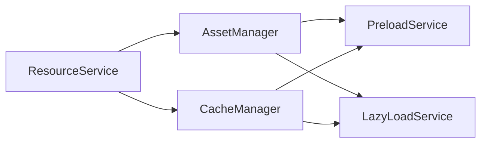
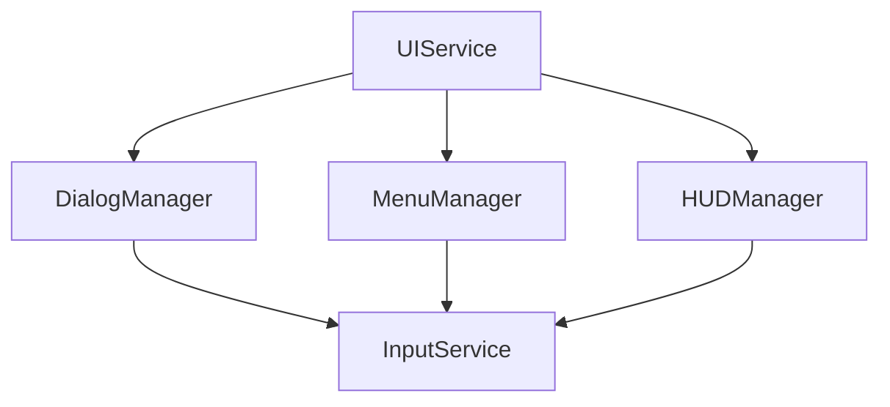
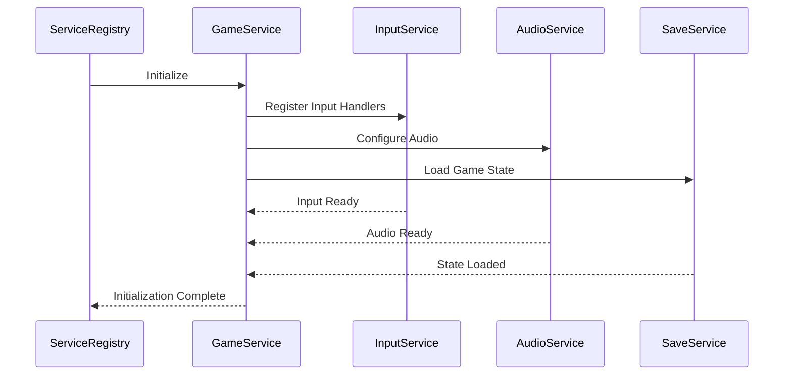

# Service Integration Documentation

## Overview
This document details the relationships and integration points between game services, resource management, and UI components. It provides a comprehensive guide for understanding service interactions, initialization sequences, and communication patterns.

## Service Relationships

### Core Service Dependencies


### Game Service Relationships
1. **GameService**
   - Coordinates with InputService for player interactions
   - Manages AudioService for game sound state
   - Uses SaveService for game state persistence
   - Integrates with DebugService for monitoring

2. **InputService**
   - Provides input state to GameService
   - Coordinates with UI services for interface interactions
   - Manages input mapping configurations

3. **AudioService**
   - Responds to GameService state changes
   - Handles sound resource management
   - Coordinates with scene transitions

4. **SaveService**
   - Manages state persistence with GameService
   - Coordinates with resource services
   - Handles save/load operations

## Resource Service Integration

### Resource Management Flow


### Key Integration Points
1. **Asset Loading**
   - Preload essential resources
   - Lazy load non-critical assets
   - Manage resource dependencies

2. **Cache Management**
   - Coordinate resource lifecycle
   - Handle memory constraints
   - Implement unload strategies

## UI Service Integration

### UI Component Hierarchy


### Integration Points
1. **Dialog System**
   - Coordinate with GameService for game state
   - Manage input focus with InputService
   - Handle audio cues with AudioService

2. **Menu System**
   - Sync with SaveService for save/load operations
   - Coordinate with InputService for navigation
   - Manage state with GameService

3. **HUD Components**
   - Update based on GameService state
   - Handle player input through InputService
   - Display debug info via DebugService

## Service Initialization Sequence

### Startup Flow


### Dependency Resolution
1. **Core Services**
   - ServiceRegistry initializes first
   - Essential services register
   - Dependencies are validated

2. **Game Systems**
   - Game services initialize after core services
   - Resource services prepare assets
   - UI services initialize last

### Error Recovery
1. **Service Failures**
   - Graceful degradation strategies
   - Retry mechanisms
   - Fallback options

## Service Communication Patterns

### Event-Based Communication
1. **Game Events**
   - State change notifications
     - Game state transitions (e.g., PLAYING, PAUSED, GAME_OVER)
     - Level loading/completion events
     - Achievement triggers
   - Resource load events
     - Asset loading progress
     - Load completion/failure notifications
     - Cache state updates
   - Error events
     - Service failures
     - Resource loading errors
     - State validation errors
   - Implementation pattern:
     ```typescript
     // Event definition
     interface GameStateChangeEvent {
       previousState: GameState;
       newState: GameState;
       timestamp: number;
       metadata?: Record<string, unknown>;
     }

     // Event emission
     this.eventBus.emit('gameState.changed', {
       previousState: GameState.LOADING,
       newState: GameState.PLAYING,
       timestamp: Date.now()
     });

     // Event subscription
     this.eventBus.on('gameState.changed', (event: GameStateChangeEvent) => {
       // Handle state change
     });
     ```

2. **UI Events**
   - Input events
     - Button clicks and interactions
     - Keyboard/mouse/touch input
     - Gesture recognition
   - Menu navigation
     - Menu open/close events
     - Navigation state changes
     - Selection events
   - Dialog triggers
     - Dialog show/hide events
     - Modal state changes
     - User response events
   - Implementation example:
     ```typescript
     // Event handling in UI components
     class MenuManager {
       private handleMenuNavigation(event: MenuNavigationEvent): void {
         // Update menu state
         this.currentMenuState = event.newState;
         
         // Notify other services
         this.eventBus.emit('menu.stateChanged', {
           previousState: event.previousState,
           newState: event.newState,
           menuId: event.menuId
         });
       }
     }
     ```

### Direct Service Methods
1. **Synchronous Operations**
   - State queries
     - Current game state checks
     - Resource availability checks
     - Configuration state queries
   - Resource checks
     - Asset availability verification
     - Cache state queries
     - Memory usage checks
   - Configuration updates
     - Settings modifications
     - Input mapping updates
     - Audio configuration changes
   - Implementation pattern:
     ```typescript
     class GameService {
       public getCurrentState(): GameState {
         return this.currentState;
       }

       public isResourceLoaded(resourceId: string): boolean {
         return this.resourceService.hasResource(resourceId);
       }

       public updateConfig(config: Partial<GameConfig>): void {
         this.validateConfig(config);
         Object.assign(this.currentConfig, config);
         this.applyConfig();
       }
     }
     ```

2. **Asynchronous Operations**
   - Resource loading
     - Asset preloading
     - Dynamic resource loading
     - Batch operations
   - State persistence
     - Save game operations
     - Configuration persistence
     - Analytics data storage
   - Network operations
     - API requests
     - Multiplayer synchronization
     - Cloud save operations
   - Implementation example:
     ```typescript
     class ResourceService {
       public async loadResource(resourceId: string): Promise<Resource> {
         try {
           const resource = await this.loader.load(resourceId);
           this.eventBus.emit('resource.loaded', { resourceId });
           return resource;
         } catch (error) {
           this.eventBus.emit('resource.error', { resourceId, error });
           throw error;
         }
       }
     }
     ```

### State Management Patterns
1. **Game State**
   - Central state management
     - Single source of truth principle
     - State immutability patterns
     - State validation rules
   - State synchronization
     - Service state coordination
     - State update propagation
     - Conflict resolution
   - State persistence
     - Serialization formats
     - State recovery mechanisms
     - Version migration
   - Implementation pattern:
     ```typescript
     class GameStateManager {
       private state: Readonly<GameState>;
       
       public updateState(update: Partial<GameState>): void {
         const newState = this.validateState({
           ...this.state,
           ...update
         });
         
         const previousState = this.state;
         this.state = Object.freeze(newState);
         
         this.notifyStateChange(previousState, this.state);
       }
       
       private notifyStateChange(previous: GameState, current: GameState): void {
         this.eventBus.emit('state.changed', { previous, current });
       }
     }
     ```

2. **UI State**
   - Menu state management
     - Navigation stack
     - Menu component states
     - Transition management
   - Dialog state tracking
     - Modal stack management
     - Dialog lifecycle events
     - Input focus management
   - HUD state updates
     - Real-time data updates
     - Component visibility states
     - Animation states
   - Implementation example:
     ```typescript
     class UIStateManager {
       private menuStack: MenuState[] = [];
       
       public pushMenu(menu: MenuState): void {
         const previousTop = this.menuStack[this.menuStack.length - 1];
         this.menuStack.push(menu);
         
         this.eventBus.emit('menu.pushed', {
           previous: previousTop,
           current: menu
         });
       }
       
       public popMenu(): MenuState | undefined {
         const popped = this.menuStack.pop();
         const newTop = this.menuStack[this.menuStack.length - 1];
         
         if (popped) {
           this.eventBus.emit('menu.popped', {
             previous: popped,
             current: newTop
           });
         }
         
         return popped;
       }
     }
     ```

## Service Migration and Versioning

### Upgrade Procedures
1. **Service Updates**
   - Version compatibility
   - State migration
   - Dependency updates

2. **Backward Compatibility**
   - State format versioning
   - API versioning
   - Migration paths

### Version Management
1. **Service Versions**
   - Version tracking
   - Compatibility matrix
   - Update requirements

## Related Documentation
- [Service Registry API](../api/service-registry-api.md)
- [MVP High-Level Architecture](patterns/mvp-high-level-architecture.md)
- [Sprint 1 Implementation Plan](decisions/sprint1-implementation-plan.md) 