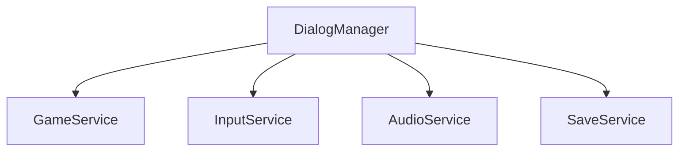
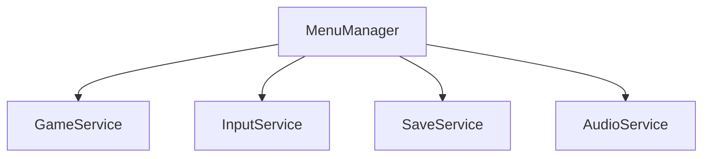
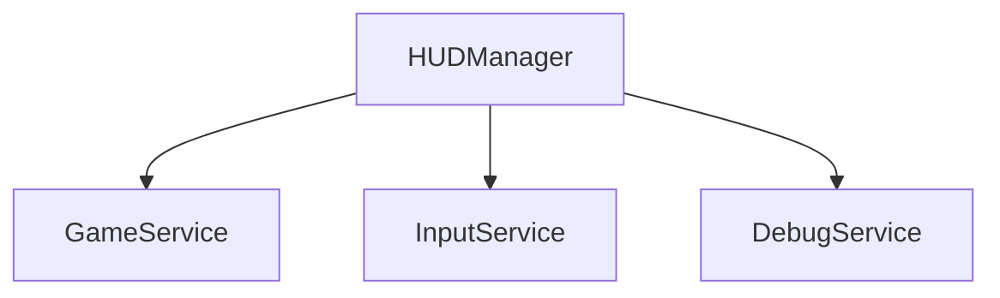

# UI Service Integration Points

## Overview
This document provides a detailed specification of UI service integration points within the game architecture, defining how UI components interact with other services and the game state.

## Core Integration Points

### 1. Game State Integration
- **State Observation**
  - UI components subscribe to GameService state changes
  - Real-time HUD updates based on player state
  - Menu state synchronization with game progress
  - Inventory and status display updates

- **State Modification**
  - Menu-triggered game state changes
  - Dialog-based story progression
  - HUD-based player interactions
  - Settings modifications

### 2. Input Management Integration
- **Input Priority System**
  - Modal dialog input capture
  - Menu navigation priority
  - HUD interaction zones
  - Game input blocking during UI focus

- **Input Event Flow**
  - Touch/click event routing
  - Keyboard navigation handling
  - Gamepad input management
  - Gesture recognition for mobile

### 3. Audio Service Integration
- **UI Sound Effects**
  - Menu navigation sounds
  - Button click feedback
  - Dialog progression audio
  - Error notification sounds

- **Audio State Management**
  - Volume control UI
  - Audio settings persistence
  - Sound category management
  - Mute state handling

## Component-Specific Integration

### 1. Dialog Manager Integration

- **Service Interactions**
  - Game state queries for dialog conditions
  - Input capture during dialog display
  - Dialog audio playback coordination
  - Dialog progress persistence

### 2. Menu Manager Integration

- **Service Interactions**
  - Save/load operations coordination
  - Settings management
  - Game state modifications
  - Menu state persistence

### 3. HUD Manager Integration

- **Service Interactions**
  - Real-time game state display
  - Player input processing
  - Debug information overlay
  - Performance metrics display

## Event Communication

### 1. UI Events
- **Outgoing Events**
  - Menu selection events
  - Dialog progression events
  - HUD interaction events
  - Settings change events

- **Incoming Events**
  - Game state update events
  - Resource load events
  - Error notification events
  - Achievement events

### 2. Event Flow Control
- **Event Priority**
  - Modal dialog priority
  - Menu system priority
  - HUD event priority
  - Game event priority

## Resource Integration

### 1. Asset Management
- **UI Asset Loading**
  - Texture loading coordination
  - Font resource management
  - Audio asset preparation
  - Animation resource handling

- **Resource State**
  - Loading state display
  - Error state handling
  - Resource cleanup
  - Cache management

### 2. Memory Management
- **UI Resource Lifecycle**
  - Component load/unload
  - Texture memory management
  - Audio resource management
  - Animation cleanup

## Error Handling

### 1. UI Error States
- **Error Display**
  - Error message presentation
  - Recovery option display
  - Debug information access
  - Error logging integration

- **Recovery Actions**
  - Retry mechanisms
  - Fallback behaviors
  - State recovery
  - Resource reloading

## Performance Considerations

### 1. UI Performance Metrics
- **Monitoring Points**
  - Render performance
  - Event processing time
  - Memory usage
  - Asset loading time

- **Optimization Hooks**
  - Component pooling
  - Event batching
  - Texture atlasing
  - Lazy loading

## Related Documentation
- [Service Integration](service-integration.md)
- [UI Component Architecture](patterns/ui-component-architecture.md)
- [Event System Documentation](event-system.md)
- [Performance Guidelines](performance-guidelines.md) 